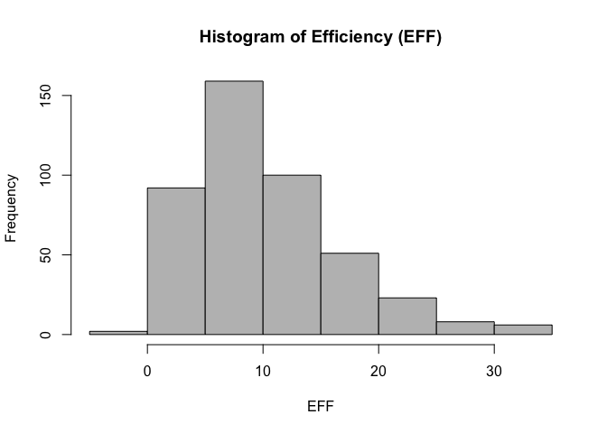
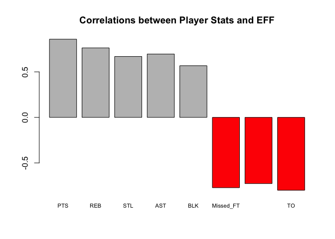
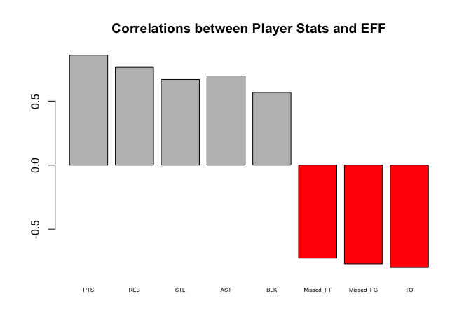
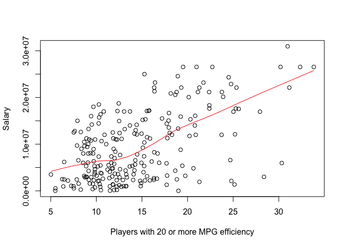

hw02-tianqi-lu
================
Tianqi Lu
9/30/2017

Import the data with base
=========================

``` r
data <- read.csv("/Users/TLuv/Downloads/stat133/stat133-hws-fall17/nba2017-player-statistics.csv", header = TRUE, colClasses = c("character", "character", "factor", "character", "double", "integer", "integer", "integer", "integer", "integer", "integer", "integer", "integer", "integer", "integer", "integer", "integer", "integer", "integer", "integer", "integer", "integer", "integer", "integer"))
```

``` r
str(data)
```

    ## 'data.frame':    441 obs. of  24 variables:
    ##  $ Player      : chr  "Al Horford" "Amir Johnson" "Avery Bradley" "Demetrius Jackson" ...
    ##  $ Team        : chr  "BOS" "BOS" "BOS" "BOS" ...
    ##  $ Position    : Factor w/ 5 levels "C","PF","PG",..: 1 2 5 3 4 3 4 5 4 2 ...
    ##  $ Experience  : chr  "9" "11" "6" "R" ...
    ##  $ Salary      : num  26540100 12000000 8269663 1450000 1410598 ...
    ##  $ Rank        : int  4 6 5 15 11 1 3 13 8 10 ...
    ##  $ Age         : int  30 29 26 22 31 27 26 21 20 29 ...
    ##  $ GP          : int  68 80 55 5 47 76 72 29 78 78 ...
    ##  $ GS          : int  68 77 55 0 0 76 72 0 20 6 ...
    ##  $ MIN         : int  2193 1608 1835 17 538 2569 2335 220 1341 1232 ...
    ##  $ FGM         : int  379 213 359 3 95 682 333 25 192 114 ...
    ##  $ FGA         : int  801 370 775 4 232 1473 720 58 423 262 ...
    ##  $ Points3     : int  86 27 108 1 39 245 157 12 46 45 ...
    ##  $ Points3_atts: int  242 66 277 1 111 646 394 35 135 130 ...
    ##  $ Points2     : int  293 186 251 2 56 437 176 13 146 69 ...
    ##  $ Points2_atts: int  559 304 498 3 121 827 326 23 288 132 ...
    ##  $ FTM         : int  108 67 68 3 33 590 176 6 85 26 ...
    ##  $ FTA         : int  135 100 93 6 41 649 217 9 124 37 ...
    ##  $ OREB        : int  95 117 65 2 17 43 48 6 45 60 ...
    ##  $ DREB        : int  369 248 269 2 68 162 367 20 175 213 ...
    ##  $ AST         : int  337 140 121 3 33 449 155 4 64 71 ...
    ##  $ STL         : int  52 52 68 0 9 70 72 10 35 26 ...
    ##  $ BLK         : int  87 62 11 0 7 13 23 2 18 17 ...
    ##  $ TO          : int  116 77 88 0 25 210 79 4 68 39 ...

``` r
library("readr")
data <- read_csv("/Users/TLuv/Downloads/stat133/stat133-hws-fall17/nba2017-player-statistics.csv", col_types = list(col_character(), col_character(), col_factor(NULL), col_character(), col_double(), col_integer(), col_integer(), col_integer(), col_integer(), col_integer(), col_integer(), col_integer(), col_integer(), col_integer(), col_integer(), col_integer(), col_integer(), col_integer(), col_integer(), col_integer(), col_integer(), col_integer(), col_integer(), col_integer()))
```

``` r
str(data)
```

    ## Classes 'tbl_df', 'tbl' and 'data.frame':    441 obs. of  24 variables:
    ##  $ Player      : chr  "Al Horford" "Amir Johnson" "Avery Bradley" "Demetrius Jackson" ...
    ##  $ Team        : chr  "BOS" "BOS" "BOS" "BOS" ...
    ##  $ Position    : Factor w/ 5 levels "C","PF","SG",..: 1 2 3 4 5 4 5 3 5 2 ...
    ##  $ Experience  : chr  "9" "11" "6" "R" ...
    ##  $ Salary      : num  26540100 12000000 8269663 1450000 1410598 ...
    ##  $ Rank        : int  4 6 5 15 11 1 3 13 8 10 ...
    ##  $ Age         : int  30 29 26 22 31 27 26 21 20 29 ...
    ##  $ GP          : int  68 80 55 5 47 76 72 29 78 78 ...
    ##  $ GS          : int  68 77 55 0 0 76 72 0 20 6 ...
    ##  $ MIN         : int  2193 1608 1835 17 538 2569 2335 220 1341 1232 ...
    ##  $ FGM         : int  379 213 359 3 95 682 333 25 192 114 ...
    ##  $ FGA         : int  801 370 775 4 232 1473 720 58 423 262 ...
    ##  $ Points3     : int  86 27 108 1 39 245 157 12 46 45 ...
    ##  $ Points3_atts: int  242 66 277 1 111 646 394 35 135 130 ...
    ##  $ Points2     : int  293 186 251 2 56 437 176 13 146 69 ...
    ##  $ Points2_atts: int  559 304 498 3 121 827 326 23 288 132 ...
    ##  $ FTM         : int  108 67 68 3 33 590 176 6 85 26 ...
    ##  $ FTA         : int  135 100 93 6 41 649 217 9 124 37 ...
    ##  $ OREB        : int  95 117 65 2 17 43 48 6 45 60 ...
    ##  $ DREB        : int  369 248 269 2 68 162 367 20 175 213 ...
    ##  $ AST         : int  337 140 121 3 33 449 155 4 64 71 ...
    ##  $ STL         : int  52 52 68 0 9 70 72 10 35 26 ...
    ##  $ BLK         : int  87 62 11 0 7 13 23 2 18 17 ...
    ##  $ TO          : int  116 77 88 0 25 210 79 4 68 39 ...
    ##  - attr(*, "spec")=List of 2
    ##   ..$ cols   :List of 24
    ##   .. ..$ Player      : list()
    ##   .. .. ..- attr(*, "class")= chr  "collector_character" "collector"
    ##   .. ..$ Team        : list()
    ##   .. .. ..- attr(*, "class")= chr  "collector_character" "collector"
    ##   .. ..$ Position    :List of 3
    ##   .. .. ..$ levels    : NULL
    ##   .. .. ..$ ordered   : logi FALSE
    ##   .. .. ..$ include_na: logi FALSE
    ##   .. .. ..- attr(*, "class")= chr  "collector_factor" "collector"
    ##   .. ..$ Experience  : list()
    ##   .. .. ..- attr(*, "class")= chr  "collector_character" "collector"
    ##   .. ..$ Salary      : list()
    ##   .. .. ..- attr(*, "class")= chr  "collector_double" "collector"
    ##   .. ..$ Rank        : list()
    ##   .. .. ..- attr(*, "class")= chr  "collector_integer" "collector"
    ##   .. ..$ Age         : list()
    ##   .. .. ..- attr(*, "class")= chr  "collector_integer" "collector"
    ##   .. ..$ GP          : list()
    ##   .. .. ..- attr(*, "class")= chr  "collector_integer" "collector"
    ##   .. ..$ GS          : list()
    ##   .. .. ..- attr(*, "class")= chr  "collector_integer" "collector"
    ##   .. ..$ MIN         : list()
    ##   .. .. ..- attr(*, "class")= chr  "collector_integer" "collector"
    ##   .. ..$ FGM         : list()
    ##   .. .. ..- attr(*, "class")= chr  "collector_integer" "collector"
    ##   .. ..$ FGA         : list()
    ##   .. .. ..- attr(*, "class")= chr  "collector_integer" "collector"
    ##   .. ..$ Points3     : list()
    ##   .. .. ..- attr(*, "class")= chr  "collector_integer" "collector"
    ##   .. ..$ Points3_atts: list()
    ##   .. .. ..- attr(*, "class")= chr  "collector_integer" "collector"
    ##   .. ..$ Points2     : list()
    ##   .. .. ..- attr(*, "class")= chr  "collector_integer" "collector"
    ##   .. ..$ Points2_atts: list()
    ##   .. .. ..- attr(*, "class")= chr  "collector_integer" "collector"
    ##   .. ..$ FTM         : list()
    ##   .. .. ..- attr(*, "class")= chr  "collector_integer" "collector"
    ##   .. ..$ FTA         : list()
    ##   .. .. ..- attr(*, "class")= chr  "collector_integer" "collector"
    ##   .. ..$ OREB        : list()
    ##   .. .. ..- attr(*, "class")= chr  "collector_integer" "collector"
    ##   .. ..$ DREB        : list()
    ##   .. .. ..- attr(*, "class")= chr  "collector_integer" "collector"
    ##   .. ..$ AST         : list()
    ##   .. .. ..- attr(*, "class")= chr  "collector_integer" "collector"
    ##   .. ..$ STL         : list()
    ##   .. .. ..- attr(*, "class")= chr  "collector_integer" "collector"
    ##   .. ..$ BLK         : list()
    ##   .. .. ..- attr(*, "class")= chr  "collector_integer" "collector"
    ##   .. ..$ TO          : list()
    ##   .. .. ..- attr(*, "class")= chr  "collector_integer" "collector"
    ##   ..$ default: list()
    ##   .. ..- attr(*, "class")= chr  "collector_guess" "collector"
    ##   ..- attr(*, "class")= chr "col_spec"

3. Right After importing the data
=================================

``` r
data$Experience[data$Experience == "R"] = 0
data$Experience <- as.integer(data$Experience)
```

4. Performance of Players
=========================

``` r
Missed_FG <- data$FGA - data$FGM
Missed_FG
```

    ##   [1]  422  157  416    1  137  791  387   33  231  148   19  248  480  260
    ##  [15]   80  282    5   79   53    1  288  233   48   96  497  138  749  608
    ##  [29]  190  175   10  362   67  824  329   72   48  311  492   53  279   76
    ##  [43]  102  230  151  127  685   77    1   15   46  155  788  284  483  389
    ##  [57]   45   85  139   51  667  225  133   34  426  127  243   73  167  542
    ##  [71]   20  221  497  603  339  415  138  150  183  345  326  190  262   99
    ##  [85]   29   98  295  179  236  366   27  507   46   89   26   91  310  425
    ##  [99]  727   24  325   17  192   42   94  186  541  110  173  682   55  194
    ## [113]  367  133  332  393  382  590  431  401   74  311  145  168   54  270
    ## [127]  467   12  324  123  428  136  105   60   79   41  420  336  558  586
    ## [141]    9   74  393  236  552   76   26   11  190  482  265    7  806  351
    ## [155]  407  323   10  582  163   21  787   44  383  517  102  305  542  198
    ## [169]  147   14   47  211  135   94  219  472  160  152  322   57  482  522
    ## [183]  338  153    5  213  548    7   21  152   29  546  319  229   21  229
    ## [197]   87  383  182  440  326   48  276   17  216   21   27  617  209  304
    ## [211]  225  208  205   55   88  207  307  430  168  286  196    8  117  378
    ## [225]  222   55  111  475   51  732   52  139  143  768  143   63  273  172
    ## [239]  131   66   98    6  244  675  116  549  268  349  301  304   37    2
    ## [253]  201  604    6  859   10  162  120  315  450  226  472   22   50  408
    ## [267]  492   79    5  411  165   10  494  510  187  304   42  293  127  149
    ## [281]  181  209  214  317  611   48  247  353    7   50  394  210  211  280
    ## [295]  207  248  289   68  335  165    5   49    9   36 1117  146  281   90
    ## [309]  520  243   52  147   23  175  250   93  628  545  321  310  297   79
    ## [323]   30  531  283  344  749  827   67  317   63  116  310  232  140   35
    ## [337]  110   16  415  120  343  316  434  336  122  187   40   82   14  362
    ## [351]    1  372  507   89  757    3   40  185  172   81  336  113  489   34
    ## [365]   19  294  241   25    3  205  382  209  183  681  201   22   57   89
    ## [379]   49  365  514  203  196  235  239  154  374  249   46  176   62   40
    ## [393]  241  101  285   84  226   31  861  117   41  329    8  677  195  205
    ## [407]   20  389  310  106  384  410   68  516   34  112  594  396  171  260
    ## [421]   49  361  144   91  159   79  129  233  316   53  825  104    6  585
    ## [435]  189  220  348   20  411  253   75

``` r
Missed_FT <- data$FTA - data$FTM
Missed_FT
```

    ##   [1]  27  33  25   3   8  59  41   3  39  11   6  33  47  15  17  11   1
    ##  [18]   4  12   1  19   5   7  14  38   1  31 173  28 107   0  28  13 102
    ##  [35]  28   4  26  41  66  23  33   5  10  17   4   5  60   5   1   2  32
    ##  [52]  16 105  56  35  20   4  10   7  10  37 198  13   1  49  18  18   4
    ##  [69]  15  94   1  20  50 141  62  56   5  33  11  17  14  27  10   3   4
    ##  [86]  17  11   8  20   9   0  55   4   8   1  10  35  58  38   8  41   0
    ## [103]  20   3  33   4  58   3   8  91   6  19  29   9  20  29  45  79 133
    ## [120]  63   3  17  18   4   2  27  59   6   6  39 218  15   2  11   7   4
    ## [137]  30  15  31  40   0   2  18  17  36   6   4   4  63  38  19   1  55
    ## [154]  18  19  42   1  41  27   5  61   2  13  32  44  14  54  19   8  11
    ## [171]   7  13  15   7  34  61 109   9  30   0  65  54  23   9   1  10  53
    ## [188]   0   2   4   2  48  32  52   1  53   9  28  31  31   9  16  17   2
    ## [205]  18   0   9  69  26  22  26  14  13   5  14   9  63  38  33  36  30
    ## [222]   7  13  62  14  21  55  48  13  32   3   8  18  37  28   1   5  33
    ## [239]   6   9  28   3  33  64  12  51  21  14  54  32   0   0  83  28   1
    ## [256] 135   1  15  45  22  21  30  33   1   4  59 101  11   0  28 220   0
    ## [273]  22  29  28  17   3  14   6  18   9  15  42  39  67  12  18  14   3
    ## [290]   1  25 165  24  22   5  64  23   5  61  53   1   4   3   2 130  14
    ## [307] 100  11  38  46  12   8   8  24  33  10  54  52  50  11  27   6   6
    ## [324]  52  40  19  26  57  31  18   4  33  47   5  34   2  11   3  38   3
    ## [341]  36  30  14  18  19  58   2  29   0  40   0  47  53  11 128   0   6
    ## [358]  11  27  24  17   6  49  16   1  25  31  11   1  22  14  15  34  39
    ## [375]   7   2  14   5  25  15  33   9  21  10  23   8  24  16   2  24   1
    ## [392]   4  20  22  44  10  50   5 130   5   7  31   0  72  23  16   3  31
    ## [409]  43  10  23  81   6  41  14  17  34  78  21  17   6  13  27  35  15
    ## [426]   3  42  58  22  12  74   7   1  70  22   5  68   1  35  16  33

``` r
PTS <- 2 * data$Points2 + 3 * data$Points3 + data$FTM
REB <- data$DREB + data$OREB
MPG <- data$MIN / data$GP
EFF <-  (PTS + REB + data$AST + data$STL + data$BLK - Missed_FG - Missed_FT - data$TO) / data$GP
summary(EFF)
```

    ##    Min. 1st Qu.  Median    Mean 3rd Qu.    Max. 
    ##  -0.600   5.452   9.090  10.137  13.247  33.840

Add the columns to the data frame
---------------------------------

``` r
EFF <- round(EFF, 5)
data <- cbind(data, Missed_FG, Missed_FT, PTS, REB, MPG, EFF)
```

``` r
hist(EFF, main = "Histogram of Efficiency (EFF)", xlab = "EFF", ylab = "Frequency", col = "grey")
```



Display the player name, team, salary, and EFF value of the top-10 players by EFF in decreasing order
-----------------------------------------------------------------------------------------------------

``` r
a <- round(head(sort(data$EFF, decreasing = TRUE), n = 10),5)
data[match(a, data$EFF), c("Player", "Team", "Salary", "EFF")]
```

    ##                    Player Team   Salary      EFF
    ## 305     Russell Westbrook  OKC 26540100 33.83951
    ## 256          James Harden  HOU 26540100 32.34568
    ## 355         Anthony Davis  NOP 22116750 31.16000
    ## 28           LeBron James  CLE 30963450 30.97297
    ## 404    Karl-Anthony Towns  MIN  5960160 30.32927
    ## 228          Kevin Durant  GSW 26540100 30.19355
    ## 74  Giannis Antetokounmpo  MIL  2995421 28.37500
    ## 359      DeMarcus Cousins  NOP 16957900 27.94118
    ## 110          Jimmy Butler  CHI 17552209 25.60526
    ## 119      Hassan Whiteside  MIA 22116750 25.36364

Provide the names of the players that have a negative EFF
---------------------------------------------------------

``` r
data[data$EFF < 0 ,"Player"]
```

    ## [1] "Patricio Garino"

Use the function cor() to compute the correlation coefficients between EFF and all the variables used in the EFF formula
------------------------------------------------------------------------------------------------------------------------

``` r
corPTS <- cor(data$EFF, data$PTS)
corREB <- cor(data$EFF, data$REB)
corAST <- cor(data$EFF, data$AST)
corSTL <- cor(data$EFF, data$STL)
corBLK <- cor(data$EFF, data$BLK)
corMFG <- -cor(data$EFF, data$Missed_FG)
corMFG
```

    ## [1] -0.7722477

``` r
corMFT <- -cor(data$EFF, data$Missed_FT)
corMFT
```

    ## [1] -0.7271456

``` r
corTO <- -cor(data$EFF, data$TO)
corGP <- cor(data$EFF, data$GP)
```

Display the computed correlations in descending order, either in a vector or a data frame. And create a barchart with the correlations (bars in decreasing order) like the one below.
-------------------------------------------------------------------------------------------------------------------------------------------------------------------------------------

``` r
a <- data.frame(c(corPTS, corREB, corAST, corSTL, corBLK, corMFG, corMFT, corTO))
b <- cbind(a, color = c(TRUE, TRUE, TRUE, TRUE, TRUE, FALSE, FALSE, FALSE))
colnames(b) = c("corr", "color")
barplot(b$corr, main = "Correlations between Player Stats and EFF", names.arg = c("PTS", "REB", "STL", "AST", "BLK", "Missed_FT", "Missed_FG", "TO"), cex.names = 0.7, col = c("red", "grey")[(b$color > 0) + 1])
```

 \# 5. Efficiency and Salary Once you’ve calculated the Efficiency statistic, produce a scatterplot between Efficiency (x-axis) and Salary (y-axis), including a lowess smooth line (locally weighted scatterplot smoothing). Also, compute the linear correlation coefficient between them. What can you say about the relationship between these two variables?

``` r
plot(x = data$EFF, y = data$Salary)
lines(lowess(data$EFF,data$Salary), col = "blue")
```



``` r
cor(data$EFF, data$Salary)
```

    ## [1] 0.655624

According to the graph, we can draw a conclusion: Generally, the more efficient a player is, the more he gets paid. But there are many players having high efficiency but getting paid little.

-   Taking into account the column MPG (minutes per game) select those players that have an MPG value of 20 or more minutes per game

``` r
players2 <- data[data$MPG >= 20, ]
```

-   Create a data frame players2 with these players

``` r
players2 <- data.frame(players2)
```

-   Use this data frame to create a scatterplot between Efficiency and Salary, including a lowess smooth line.

``` r
plot(players2$EFF, players2$Salary)
lines(lowess(players2$EFF, players2$Salary), col = "red")
```

 - Compute the linear correlation coefficient between these variables.

``` r
cor(players2$EFF, players2$Salary)
```

    ## [1] 0.5367224

-   What can you say about the relationship between these two variables for the set of “more established players”?

It's more proper to say the more efficient a player is, the more he gets paid.
