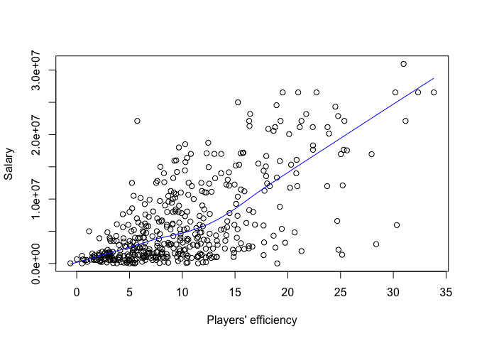

hw02-tianqi-lu
================
Tianqi Lu
9/30/2017

Import the data with base
=========================

``` r
github <- "https://github.com/ucb-stat133/stat133-fall-2017/raw/master/"
file <- "data/nba2017-player-statistics.csv"
csv <- paste0(github, file)
download.file(url = csv, destfile = 'data/nba2017-player-statistics.csv')
```

``` r
data <- read.csv("/Users/TLuv/Downloads/stat133/stat133-hws-fall17/hw02/data/nba2017-player-statistics.csv", header = TRUE, colClasses = c("character", "character", "factor", "character", "double", "integer", "integer", "integer", "integer", "integer", "integer", "integer", "integer", "integer", "integer", "integer", "integer", "integer", "integer", "integer", "integer", "integer", "integer", "integer"))
```

``` r
str(data)
```

    ## 'data.frame':    441 obs. of  24 variables:
    ##  $ Player      : chr  "Al Horford" "Amir Johnson" "Avery Bradley" "Demetrius Jackson" ...
    ##  $ Team        : chr  "BOS" "BOS" "BOS" "BOS" ...
    ##  $ Position    : Factor w/ 5 levels "C","PF","PG",..: 1 2 5 3 4 3 4 5 4 2 ...
    ##  $ Experience  : chr  "9" "11" "6" "R" ...
    ##  $ Salary      : num  26540100 12000000 8269663 1450000 1410598 ...
    ##  $ Rank        : int  4 6 5 15 11 1 3 13 8 10 ...
    ##  $ Age         : int  30 29 26 22 31 27 26 21 20 29 ...
    ##  $ GP          : int  68 80 55 5 47 76 72 29 78 78 ...
    ##  $ GS          : int  68 77 55 0 0 76 72 0 20 6 ...
    ##  $ MIN         : int  2193 1608 1835 17 538 2569 2335 220 1341 1232 ...
    ##  $ FGM         : int  379 213 359 3 95 682 333 25 192 114 ...
    ##  $ FGA         : int  801 370 775 4 232 1473 720 58 423 262 ...
    ##  $ Points3     : int  86 27 108 1 39 245 157 12 46 45 ...
    ##  $ Points3_atts: int  242 66 277 1 111 646 394 35 135 130 ...
    ##  $ Points2     : int  293 186 251 2 56 437 176 13 146 69 ...
    ##  $ Points2_atts: int  559 304 498 3 121 827 326 23 288 132 ...
    ##  $ FTM         : int  108 67 68 3 33 590 176 6 85 26 ...
    ##  $ FTA         : int  135 100 93 6 41 649 217 9 124 37 ...
    ##  $ OREB        : int  95 117 65 2 17 43 48 6 45 60 ...
    ##  $ DREB        : int  369 248 269 2 68 162 367 20 175 213 ...
    ##  $ AST         : int  337 140 121 3 33 449 155 4 64 71 ...
    ##  $ STL         : int  52 52 68 0 9 70 72 10 35 26 ...
    ##  $ BLK         : int  87 62 11 0 7 13 23 2 18 17 ...
    ##  $ TO          : int  116 77 88 0 25 210 79 4 68 39 ...

``` r
library("readr")
data1 <- read_csv("/Users/TLuv/Downloads/stat133/stat133-hws-fall17/hw02/data/nba2017-player-statistics.csv", col_types = list(col_character(), col_character(), col_factor(NULL), col_character(), col_double(), col_integer(), col_integer(), col_integer(), col_integer(), col_integer(), col_integer(), col_integer(), col_integer(), col_integer(), col_integer(), col_integer(), col_integer(), col_integer(), col_integer(), col_integer(), col_integer(), col_integer(), col_integer(), col_integer()))
```

``` r
str(data)
```

    ## 'data.frame':    441 obs. of  24 variables:
    ##  $ Player      : chr  "Al Horford" "Amir Johnson" "Avery Bradley" "Demetrius Jackson" ...
    ##  $ Team        : chr  "BOS" "BOS" "BOS" "BOS" ...
    ##  $ Position    : Factor w/ 5 levels "C","PF","PG",..: 1 2 5 3 4 3 4 5 4 2 ...
    ##  $ Experience  : chr  "9" "11" "6" "R" ...
    ##  $ Salary      : num  26540100 12000000 8269663 1450000 1410598 ...
    ##  $ Rank        : int  4 6 5 15 11 1 3 13 8 10 ...
    ##  $ Age         : int  30 29 26 22 31 27 26 21 20 29 ...
    ##  $ GP          : int  68 80 55 5 47 76 72 29 78 78 ...
    ##  $ GS          : int  68 77 55 0 0 76 72 0 20 6 ...
    ##  $ MIN         : int  2193 1608 1835 17 538 2569 2335 220 1341 1232 ...
    ##  $ FGM         : int  379 213 359 3 95 682 333 25 192 114 ...
    ##  $ FGA         : int  801 370 775 4 232 1473 720 58 423 262 ...
    ##  $ Points3     : int  86 27 108 1 39 245 157 12 46 45 ...
    ##  $ Points3_atts: int  242 66 277 1 111 646 394 35 135 130 ...
    ##  $ Points2     : int  293 186 251 2 56 437 176 13 146 69 ...
    ##  $ Points2_atts: int  559 304 498 3 121 827 326 23 288 132 ...
    ##  $ FTM         : int  108 67 68 3 33 590 176 6 85 26 ...
    ##  $ FTA         : int  135 100 93 6 41 649 217 9 124 37 ...
    ##  $ OREB        : int  95 117 65 2 17 43 48 6 45 60 ...
    ##  $ DREB        : int  369 248 269 2 68 162 367 20 175 213 ...
    ##  $ AST         : int  337 140 121 3 33 449 155 4 64 71 ...
    ##  $ STL         : int  52 52 68 0 9 70 72 10 35 26 ...
    ##  $ BLK         : int  87 62 11 0 7 13 23 2 18 17 ...
    ##  $ TO          : int  116 77 88 0 25 210 79 4 68 39 ...

3. Right After importing the data
=================================

``` r
data$Experience[data$Experience == "R"] = 0
data$Experience <- as.integer(data$Experience)
```

4. Performance of Players
=========================

``` r
Missed_FG <- data$FGA - data$FGM
Missed_FT <- data$FTA - data$FTM
PTS <- 2 * data$Points2 + 3 * data$Points3 + data$FTM
REB <- data$DREB + data$OREB
MPG <- data$MIN / data$GP
EFF <-  (PTS + REB + data$AST + data$STL + data$BLK - Missed_FG - Missed_FT - data$TO) / data$GP
summary(EFF)
```

    ##    Min. 1st Qu.  Median    Mean 3rd Qu.    Max. 
    ##  -0.600   5.452   9.090  10.137  13.247  33.840

Add the columns to the data frame
---------------------------------

``` r
data <- cbind(data, Missed_FG, Missed_FT, PTS, REB, MPG, EFF)
```

``` r
hist(EFF, main = "Histogram of Efficiency (EFF)", xlab = "EFF", ylab = "Frequency", col = "grey")
```


Display the player name, team, salary, and EFF value of the top-10 players by EFF in decreasing order
-----------------------------------------------------------------------------------------------------

``` r
a <- head(sort(data$EFF, decreasing = TRUE), n = 10)
data[match(a, data$EFF), c("Player", "Team", "Salary", "EFF")]
```

    ##                    Player Team   Salary      EFF
    ## 305     Russell Westbrook  OKC 26540100 33.83951
    ## 256          James Harden  HOU 26540100 32.34568
    ## 355         Anthony Davis  NOP 22116750 31.16000
    ## 28           LeBron James  CLE 30963450 30.97297
    ## 404    Karl-Anthony Towns  MIN  5960160 30.32927
    ## 228          Kevin Durant  GSW 26540100 30.19355
    ## 74  Giannis Antetokounmpo  MIL  2995421 28.37500
    ## 359      DeMarcus Cousins  NOP 16957900 27.94118
    ## 110          Jimmy Butler  CHI 17552209 25.60526
    ## 119      Hassan Whiteside  MIA 22116750 25.36364

Provide the names of the players that have a negative EFF
---------------------------------------------------------

``` r
data[data$EFF < 0 ,"Player"]
```

    ## [1] "Patricio Garino"

Use the function cor() to compute the correlation coefficients between EFF and all the variables used in the EFF formula
------------------------------------------------------------------------------------------------------------------------

``` r
corPTS <- cor(data$EFF, data$PTS)
corREB <- cor(data$EFF, data$REB)
corAST <- cor(data$EFF, data$AST)
corSTL <- cor(data$EFF, data$STL)
corBLK <- cor(data$EFF, data$BLK)
corMFG <- -cor(data$EFF, data$Missed_FG)
corMFG
```

    ## [1] -0.7722477

``` r
corMFT <- -cor(data$EFF, data$Missed_FT)
corMFT
```

    ## [1] -0.7271456

``` r
corTO <- -cor(data$EFF, data$TO)
corGP <- cor(data$EFF, data$GP)
```

Display the computed correlations in descending order, either in a vector or a data frame. And create a barchart with the correlations (bars in decreasing order) like the one below.
-------------------------------------------------------------------------------------------------------------------------------------------------------------------------------------

``` r
a <- data.frame(c(corPTS, corREB, corAST, corSTL, corBLK, corMFT, corMFG, corTO))
b <- cbind(a, color = c(TRUE, TRUE, TRUE, TRUE, TRUE, FALSE, FALSE, FALSE))
colnames(b) = c("corr", "color")
barplot(b$corr, main = "Correlations between Player Stats and EFF", names.arg = c("PTS", "REB", "STL", "AST", "BLK", "Missed_FT", "Missed_FG", "TO"), cex.names = 0.5, col = c("red", "grey")[(b$color > 0) + 1])
```

 \# 5. Efficiency and Salary Once you’ve calculated the Efficiency statistic, produce a scatterplot between Efficiency (x-axis) and Salary (y-axis), including a lowess smooth line (locally weighted scatterplot smoothing). Also, compute the linear correlation coefficient between them. What can you say about the relationship between these two variables?

``` r
plot(x = data$EFF, y = data$Salary, xlab = "Players' efficiency", ylab = "Salary")
lines(lowess(data$EFF,data$Salary), col = "blue")
```



``` r
cor(data$EFF, data$Salary)
```

    ## [1] 0.655624

According to the graph, we can draw a conclusion: Generally, the more efficient a player is, the more he gets paid. But there are many players having high efficiency but getting paid little.

-   Taking into account the column MPG (minutes per game) select those players that have an MPG value of 20 or more minutes per game

``` r
players2 <- data[data$MPG >= 20, ]
```

-   Create a data frame players2 with these players

``` r
players2 <- data.frame(players2)
```

-   Use this data frame to create a scatterplot between Efficiency and Salary, including a lowess smooth line.

``` r
plot(players2$EFF, players2$Salary, xlab = "Players with 20 or more MPG efficiency", ylab = "Salary")
lines(lowess(players2$EFF, players2$Salary), col = "red")
```

 - Compute the linear correlation coefficient between these variables.

``` r
cor(players2$EFF, players2$Salary)
```

    ## [1] 0.5367224

-   What can you say about the relationship between these two variables for the set of “more established players”?

It's more proper to say the more efficient a player is, the more he gets paid.
