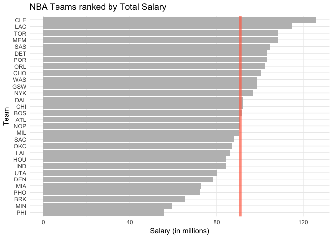
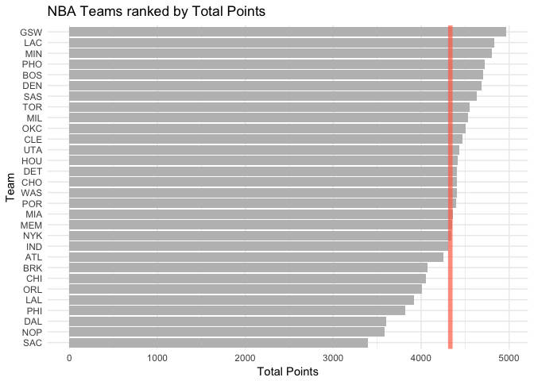
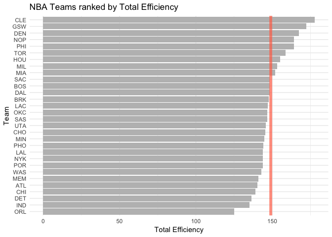
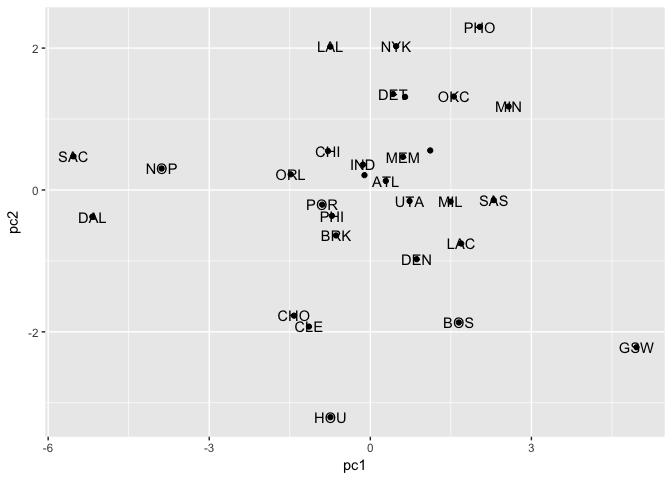
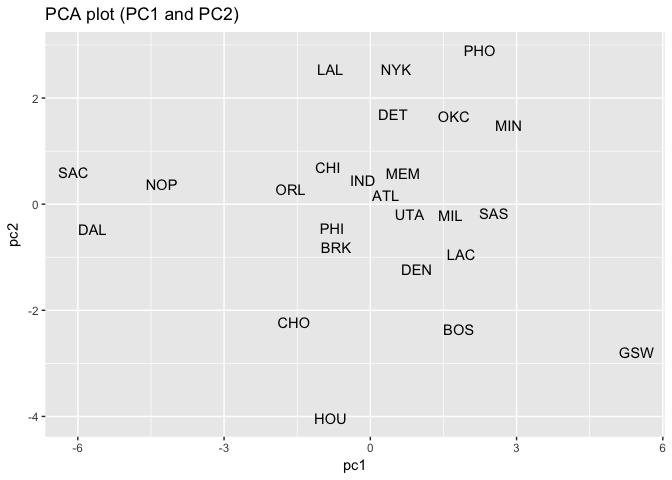
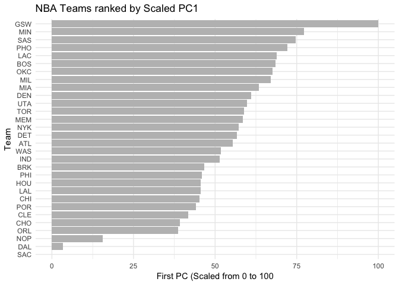

hw03-tianqi-lu
================
Tianqi Lu
10/15/2017

Rankng of Teams
===============

The analysis stage of this assignment has to do with looking at various ways to rank the teams. Use an Rmd file for this part of your project.

Basic Rankings
--------------

Start by ranking the teams according to salary, arranged in decreasing order. Use ggplot() to create a barchart (horizontally oriented), like the one shown below. The vertical red line is the average team salary.

``` r
# Load needed libraries and create the table
library(scales)
library(ggplot2)
library(readr)
```

    ## 
    ## Attaching package: 'readr'

    ## The following object is masked from 'package:scales':
    ## 
    ##     col_factor

``` r
library(dplyr)
```

    ## Warning: package 'dplyr' was built under R version 3.4.2

    ## 
    ## Attaching package: 'dplyr'

    ## The following objects are masked from 'package:stats':
    ## 
    ##     filter, lag

    ## The following objects are masked from 'package:base':
    ## 
    ##     intersect, setdiff, setequal, union

``` r
teams <- read_csv('../data/nba2017-teams.csv')
```

    ## Parsed with column specification:
    ## cols(
    ##   team = col_character(),
    ##   experience = col_integer(),
    ##   salary = col_double(),
    ##   points3 = col_integer(),
    ##   points2 = col_integer(),
    ##   free_throws = col_integer(),
    ##   points = col_integer(),
    ##   off_rebounds = col_integer(),
    ##   def_rebounds = col_integer(),
    ##   assists = col_integer(),
    ##   steals = col_integer(),
    ##   blocks = col_integer(),
    ##   turnovers = col_integer(),
    ##   fouls = col_integer(),
    ##   efficiency = col_double()
    ## )

``` r
# Plot the chart
ggplot(teams, aes(x = reorder(team, salary), y=salary)) +
  geom_bar(stat='identity', fill = 'grey') +
  geom_abline(intercept = mean(teams$salary), slope = 0, 
              color = alpha('coral1', 0.7), size = 2)+
  coord_flip()+
  labs(y = 'Salary (in millions)', x = 'Team', 
       title = 'NBA Teams ranked by Total Salary')+
  theme_minimal()
```



The entire ranking is

``` r
select(arrange(teams, desc(salary)), team)
```

    ## # A tibble: 30 x 1
    ##     team
    ##    <chr>
    ##  1   CLE
    ##  2   LAC
    ##  3   TOR
    ##  4   MEM
    ##  5   SAS
    ##  6   DET
    ##  7   POR
    ##  8   ORL
    ##  9   CHO
    ## 10   WAS
    ## # ... with 20 more rows

Create another bar chart of teams ranked by total points. The vertical red line is the average team points.

``` r
library(scales)
ggplot(teams, aes(x = reorder(team, points), y=points)) +
  geom_bar(stat='identity', fill = 'grey') +
  geom_abline(intercept = mean(teams$points), slope = 0, 
              color = alpha('coral1', 0.7), size = 2)+
  coord_flip()+
  labs(y = 'Total Points', x = 'Team', 
       title = 'NBA Teams ranked by Total Points')+
  theme_minimal()
```



The entire ranking is

``` r
select(arrange(teams, desc(points)), team)
```

    ## # A tibble: 30 x 1
    ##     team
    ##    <chr>
    ##  1   GSW
    ##  2   LAC
    ##  3   MIN
    ##  4   PHO
    ##  5   BOS
    ##  6   DEN
    ##  7   SAS
    ##  8   TOR
    ##  9   MIL
    ## 10   OKC
    ## # ... with 20 more rows

Use efficiency to obtain a third kind of ranking, and create an associated bar chart of teams ranked by total efficiency. The vertical red line is the average team efficiency.

``` r
library(scales)
ggplot(teams, aes(x = reorder(team, efficiency), y = efficiency)) +
  geom_bar(stat='identity', fill = 'grey') +
  geom_abline(intercept = mean(teams$efficiency), slope = 0, 
              color = alpha('coral1', 0.7), size = 2)+
  coord_flip()+
  labs(y = 'Total Efficiency', x = 'Team', 
       title = 'NBA Teams ranked by Total Efficiency')+
  theme_minimal()
```



The entire ranking is

``` r
select(arrange(teams, desc(efficiency)), team)
```

    ## # A tibble: 30 x 1
    ##     team
    ##    <chr>
    ##  1   CLE
    ##  2   GSW
    ##  3   DEN
    ##  4   NOP
    ##  5   PHI
    ##  6   TOR
    ##  7   HOU
    ##  8   MIL
    ##  9   MIA
    ## 10   SAC
    ## # ... with 20 more rows

Principal Components Analysis (PCA)
-----------------------------------

Perform a principal components analysis (PCA) on the following variables, to use the first principal component (PC1) as another index to rank the teams:

``` r
# select the variables that we are interested in from teams
focus <- teams[, -c(1, 2, 3, 7, 15)]
# create pca object (containnig all the PC's)
pca <- prcomp(focus, scale. = TRUE)
# add PC1 PC2 back to teams
teams <- mutate(teams, pc1 = pca$x[ ,1], pc2 = pca$x[ ,2])
# rearrrange team by PC1 in descending order
select(arrange(teams, desc(pc1)), team)
```

    ## # A tibble: 30 x 1
    ##     team
    ##    <chr>
    ##  1   GSW
    ##  2   MIN
    ##  3   SAS
    ##  4   PHO
    ##  5   LAC
    ##  6   BOS
    ##  7   OKC
    ##  8   MIL
    ##  9   MIA
    ## 10   DEN
    ## # ... with 20 more rows

Createa a data frame with the eigenvalues:

``` r
eigs <- data.frame(
  eigenvalue = round(pca$sdev^2, 4),
  prop = round(pca$sdev^2 / sum(pca$sdev^2), 4),
  cumprop = round(cumsum(pca$sdev^2 / sum(pca$sdev^2)), 4)
  )
eigs
```

    ##    eigenvalue   prop cumprop
    ## 1      4.6959 0.4696  0.4696
    ## 2      1.7020 0.1702  0.6398
    ## 3      0.9795 0.0980  0.7377
    ## 4      0.7717 0.0772  0.8149
    ## 5      0.5341 0.0534  0.8683
    ## 6      0.4780 0.0478  0.9161
    ## 7      0.3822 0.0382  0.9543
    ## 8      0.2603 0.0260  0.9804
    ## 9      0.1336 0.0134  0.9937
    ## 10     0.0627 0.0063  1.0000

``` r
ggplot(data = teams, aes(pc1, pc2, label = team)) + 
  geom_point() + 
  geom_text(check_overlap = TRUE)
```

 \#\# Principal Components Analysis (PCA)

Perform a principal components analysis (PCA) on the following variables, to use the first principal component (PC1) as another index to rank the teams:

``` r
# select the variables that we are interested in from teams
focus <- teams[, -c(1, 2, 3, 7, 15)]
# create pca object (containnig all the PC's)
pca <- prcomp(focus, scale. = TRUE)
# add PC1 PC2 back to teams
teams_with_pc <- mutate(teams, pc1 = pca$x[ ,1], pc2 = pca$x[ ,2])
# rearrrange team by PC1 in descending order
select(arrange(teams_with_pc, desc(pc1)), team)
```

    ## # A tibble: 30 x 1
    ##     team
    ##    <chr>
    ##  1   GSW
    ##  2   MIN
    ##  3   SAS
    ##  4   PHO
    ##  5   LAC
    ##  6   BOS
    ##  7   OKC
    ##  8   MIL
    ##  9   MIA
    ## 10   DEN
    ## # ... with 20 more rows

Createa a data frame with the eigenvalues:

``` r
eigs <- data.frame(
  eigenvalue = round(pca$sdev^2, 4),
  prop = round(pca$sdev^2 / sum(pca$sdev^2), 4),
  cumprop = round(cumsum(pca$sdev^2 / sum(pca$sdev^2)), 4)
  )
eigs
```

    ##    eigenvalue   prop cumprop
    ## 1      5.6959 0.4747  0.4747
    ## 2      2.7020 0.2252  0.6998
    ## 3      0.9795 0.0816  0.7815
    ## 4      0.7717 0.0643  0.8458
    ## 5      0.5341 0.0445  0.8903
    ## 6      0.4780 0.0398  0.9301
    ## 7      0.3822 0.0319  0.9620
    ## 8      0.2603 0.0217  0.9836
    ## 9      0.1336 0.0111  0.9948
    ## 10     0.0627 0.0052  1.0000
    ## 11     0.0000 0.0000  1.0000
    ## 12     0.0000 0.0000  1.0000

Use the first two PCs to get a scatterplot of the teams

``` r
ggplot(data = teams_with_pc, aes(pc1, pc2, label = team)) + 
  geom_text(check_overlap = TRUE) +
  ggtitle('PCA plot (PC1 and PC2)')
```



In order to build an index based on the first PC, you are going to transform PC1. To get a more meaningful scale, you can rescale the first PC with a new scale ranging from 0 to 100. Once you have obtained the rescaled PC1, you can produce a barchart like the previous ones.

``` r
# rescale PC1
teams_with_pc = mutate(teams_with_pc, 
               rs_pc1 = 100 * (teams_with_pc$pc1 - min(teams_with_pc$pc1)) 
               / (max(teams_with_pc$pc1) - min(teams_with_pc$pc1)))

# create a barchart from the rescaled pc1
ggplot(teams_with_pc, aes(x = reorder(team, rs_pc1), y = rs_pc1)) +
  geom_bar(stat='identity', fill = 'grey') +
  coord_flip()+
  labs(y = 'First PC (Scaled from 0 to 100', x = 'Team', 
       title = 'NBA Teams ranked by Scaled PC1') +
  theme_minimal()
```



Use the scaled PC1 to rank the teams:

``` r
select(arrange(teams_with_pc, desc(rs_pc1)), team)
```

    ## # A tibble: 30 x 1
    ##     team
    ##    <chr>
    ##  1   GSW
    ##  2   MIN
    ##  3   SAS
    ##  4   PHO
    ##  5   LAC
    ##  6   BOS
    ##  7   OKC
    ##  8   MIL
    ##  9   MIA
    ## 10   DEN
    ## # ... with 20 more rows
