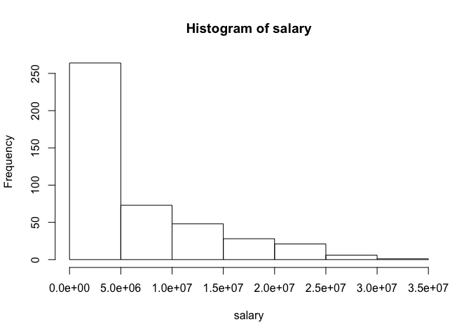
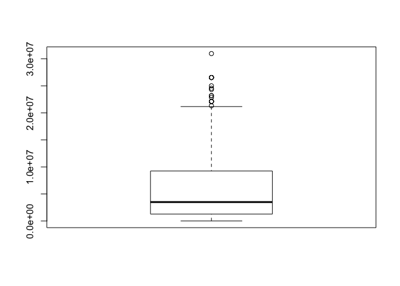

up02-tianqi-lu
================
Tianqi Lu
9/17/2017

Warm-Up 02 - Stat 133, Fall 2017
================================

**Due date:** Saturday Sep-16, 2017 (before midnight)

The purpose of this assignment is to work with vectors of different data types: numeric (integer and real), character, logical, and factors.

Introduction
------------

In this assignment you will summarize quantitative and qualitative variables graphically and numerically. These tasks are often the first step in analyzing most data sets. Technically, this involves performing a univariate analysis, that is, analyzing one variable at a time. In future assignments you will work on analyzing two or more variables simultaneously.

Keep in mind that summarizing and describing data, as simple as it may sound, can be tricky. Why? Because there is not one right way to analyze data, but there are wrong ways. Do your best to describe what you see. Jot down notes to capture your thinking as you go. It does not matter if you lack the technical terminology to write such descriptions: use your own words. It takes practice to learn to describe distributions and write an analysis. You will work on these skills over the rest of the semester.

This HW is the second *dummy* or warming-up assignment (i.e. it won't count towards your final grade). Tackle any logistic problems, and make sure R, RStudio, bCourses, and your computer work nicely---without being penalized. Later on you will also include version control tools such as Git and Github.

Research Question and Data
--------------------------

As I mentioned in class, the starting research question is: **"the more points a player scores, the higher his salary?"**

You are NOT going to try to answer this question in this assignment. What you have to do is start to get to know the data.

### Data

The data set for this assignment is data about NBA players during the regular season of 2016-2017. The corresponding files are in a github repo specifically created for HW assignments:

<https://github.com/ucb-stat133/stat133-hws-fall17/tree/master/warmup02/data>

You will find a data file `nba2017-salary-points.RData`. This is a binary file (native's R binary format), which means that you won't be able to see its contents with a text editor (only R knows how to open this type of files).

There is also a data dictionary file `nba2017-salary-points-dictionary.md` that provides more information about the contents in `nba2017-salary-points.RData`. Please read the contents of the data dictionary.

### Download the data file

To read the data in R, we recommend that you download the `.RData` to your computer. You can use the function `download.file()` to do this. The file will be downloaded to the specified destination (`destfile`). In the code below, the binary file woud be downloaded to your [working directory](https://www.computerhope.com/jargon/c/currentd.htm):

``` r
# assembling url (so it fits on the screen)
github <- 'https://github.com/ucb-stat133/stat133-hws-fall17/'
repo <- 'raw/master/warmup02/data/nba2017-salary-points.RData'

download.file(url = paste0(github, repo), destfile = "nba2017-salary-points.RData")
```

You only have to download the file once. By the way, there is NO need to include the previous command in your source `.Rmd` file. Otherwise, everytime you knit the file, R will download the file.

### Importing the data

Open a new `.Rmd` file (this will be your source file). Once you have `nba2017-salary-points.RData` in your computer, use the `load()` function, which allows you to import `.RData` files into R:

``` r
# load the objects
load("nba2017-salary-points.RData")

# list the available objects
ls()
```

    ##  [1] "experience" "github"     "player"     "points"     "points1"   
    ##  [6] "points2"    "points3"    "position"   "repo"       "salary"    
    ## [11] "team"

Inspect the objects in the `.RData` file:
-----------------------------------------

The first step is to inspect the data. This is actullay the *first contact* stage. And to be honest, most of the work you do in this stage never gets reported. But this does not mean that it is worthless or less important. Here are various questions for you to consider while "getting to know the data":

-   Make sure you have all the objects described in the data dictionary.
-   What class of objects are in the file?
-   Are there any vectors, factors, lists?
-   What flavor is each vector (i.e. variable)?
-   Check that all objects have the same length.

`length(team)` yes their lengths are the same, 441.

Exploratory Data Analysis
-------------------------

Pick at least one categorical variable and at least one quantitative variable to explore. You willl have to perform a complete exploratory analysis. This involves getting summary statistics as well as visual displays.

### Quantitative Variable

For the selected quantitative variable, describe the overall pattern (shape, center, and spread) and striking deviation from the pattern.

-   Use the `summary()` function to get a quick summary of descriptive statitstics for each numeric vector
-   Now, look up for functions that allow you to get the following statistics:
    -   mean (i.e. average)
    -   standard deviation
    -   minimum value
    -   maximum value
    -   median
    -   quartiles
-   What are the typical values in each vector?
-   What's the spread in each vector?
-   Look at the distribution: use `hist()` and `boxplot()`.
-   You can also try to get a density curve (or density polygon). Find out how to do this.

``` r
summary(salary)
```

    ##     Min.  1st Qu.   Median     Mean  3rd Qu.     Max. 
    ##     5145  1286160  3500000  6187014  9250000 30963450

``` r
hist(salary)
```



``` r
boxplot(salary)
```



``` r
plot(density(salary))
```


### Qualitative Variable

-   Pick one of the categorical variables: `team` or `position`.
-   If the variable that you choose is not an R factor, then use `factor()` to convert the object into a factor.
-   Use `table()` to get a frequency table (i.e. counts of each category).
-   Find out how to use the obtained frequency table to calculate relative frequencies (proportions).
-   Use the frequencies (counts) and relative frequencies (proportions) to describe the overall distribution.
-   Use `barplot()` to display the frequencies with a barchart.

``` r
# notice that position is not a factor
position <- factor(position)

# frequency table
table(position)
```

    ## position
    ##  C PF PG SF SG 
    ## 89 89 85 83 95

``` r
# relative frequency table
table(position)/sum(table(position))
```

    ## position
    ##         C        PF        PG        SF        SG 
    ## 0.2018141 0.2018141 0.1927438 0.1882086 0.2154195

``` r
# each position has almost the same number of players

# barchart
barplot(table(position))
```


